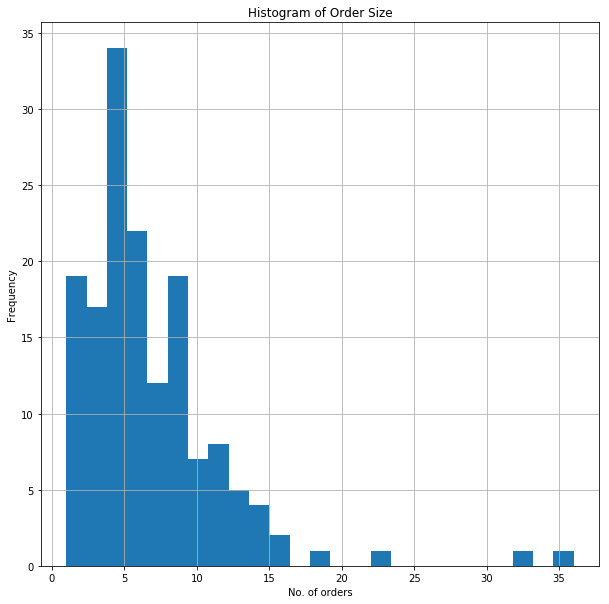
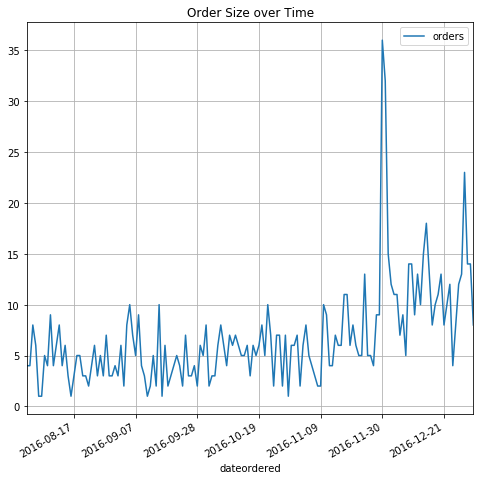
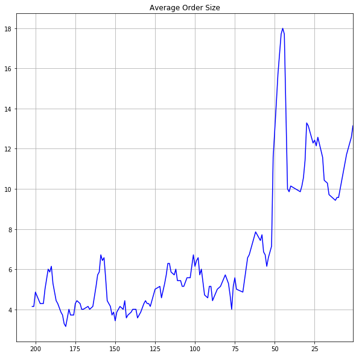

```python
### Author : Rahul Bhat
### Date : 13th August 2017
### Task :  Casper 
```


```python
### import libraries 

import pandas as pd

import numpy as np

import matplotlib.mlab as mlab

import matplotlib.pyplot as plt


```


```python
#### Load the data set
casper = pd.read_excel('/Users/Bhat/Downloads/casper.xlsx') 
```


```python

#### Explore the data set
casper.head()

```


<div>
<style>
    .dataframe thead tr:only-child th {
        text-align: right;
    }

    .dataframe thead th {
        text-align: left;
    }

    .dataframe tbody tr th {
        vertical-align: top;
    }
</style>
<table border="1" class="dataframe">
  <thead>
    <tr style="text-align: right;">
      <th></th>
      <th>dateordered</th>
      <th>datereturned</th>
      <th>orderstatus</th>
      <th>orders</th>
    </tr>
  </thead>
  <tbody>
    <tr>
      <th>0</th>
      <td>2016-12-31</td>
      <td>2017-01-24</td>
      <td>returned</td>
      <td>1</td>
    </tr>
    <tr>
      <th>1</th>
      <td>2016-12-31</td>
      <td>NaT</td>
      <td>complete</td>
      <td>8</td>
    </tr>
    <tr>
      <th>2</th>
      <td>2016-12-30</td>
      <td>NaT</td>
      <td>complete</td>
      <td>14</td>
    </tr>
    <tr>
      <th>3</th>
      <td>2016-12-29</td>
      <td>NaT</td>
      <td>complete</td>
      <td>14</td>
    </tr>
    <tr>
      <th>4</th>
      <td>2016-12-28</td>
      <td>2016-12-29</td>
      <td>returned</td>
      <td>1</td>
    </tr>
  </tbody>
</table>
</div>


```python
casper.tail()

```


<div>
<style>
    .dataframe thead tr:only-child th {
        text-align: right;
    }

    .dataframe thead th {
        text-align: left;
    }

    .dataframe tbody tr th {
        vertical-align: top;
    }
</style>
<table border="1" class="dataframe">
  <thead>
    <tr style="text-align: right;">
      <th></th>
      <th>dateordered</th>
      <th>datereturned</th>
      <th>orderstatus</th>
      <th>orders</th>
    </tr>
  </thead>
  <tbody>
    <tr>
      <th>208</th>
      <td>2016-08-04</td>
      <td>NaT</td>
      <td>complete</td>
      <td>6</td>
    </tr>
    <tr>
      <th>209</th>
      <td>2016-08-03</td>
      <td>2016-08-25</td>
      <td>returned</td>
      <td>1</td>
    </tr>
    <tr>
      <th>210</th>
      <td>2016-08-03</td>
      <td>NaT</td>
      <td>complete</td>
      <td>8</td>
    </tr>
    <tr>
      <th>211</th>
      <td>2016-08-02</td>
      <td>NaT</td>
      <td>complete</td>
      <td>4</td>
    </tr>
    <tr>
      <th>212</th>
      <td>2016-08-01</td>
      <td>NaT</td>
      <td>complete</td>
      <td>4</td>
    </tr>
  </tbody>
</table>
</div>


```python
#### Lets see the count 

casper.count()


```


    dateordered     213
    datereturned     60
    orderstatus     213
    orders          213
    dtype: int64


```python
#### Summary of the data set 

casper.describe()

##### We can see that the total number of orders are 213 and minimum 1 order is returned and total returned 
#### orders are 60.
```


<div>
<style>
    .dataframe thead tr:only-child th {
        text-align: right;
    }

    .dataframe thead th {
        text-align: left;
    }

    .dataframe tbody tr th {
        vertical-align: top;
    }
</style>
<table border="1" class="dataframe">
  <thead>
    <tr style="text-align: right;">
      <th></th>
      <th>orders</th>
    </tr>
  </thead>
  <tbody>
    <tr>
      <th>count</th>
      <td>213.000000</td>
    </tr>
    <tr>
      <th>mean</th>
      <td>5.131455</td>
    </tr>
    <tr>
      <th>std</th>
      <td>4.891425</td>
    </tr>
    <tr>
      <th>min</th>
      <td>1.000000</td>
    </tr>
    <tr>
      <th>25%</th>
      <td>1.000000</td>
    </tr>
    <tr>
      <th>50%</th>
      <td>4.000000</td>
    </tr>
    <tr>
      <th>75%</th>
      <td>7.000000</td>
    </tr>
    <tr>
      <th>max</th>
      <td>36.000000</td>
    </tr>
  </tbody>
</table>
</div>


```python
##### Order is either complete or return and lets see how many orders are complete and how many are returned. 

complete_orders = casper[casper['orderstatus'] == 'complete']
complete_orders.count()

#### We have 153 complete orders without any return.
```


    dateordered     153
    datereturned      0
    orderstatus     153
    orders          153
    dtype: int64


```python
#### Summary of complete_orders (complete orders summary)
complete_orders.describe()


#### We can see that the average transaction orders are 6.751 and the median transaction is 6.00 orders. 
#### We can say that the distribution of orders are right-skewed and the average size of the order is above the median.

```


<div>
<style>
    .dataframe thead tr:only-child th {
        text-align: right;
    }

    .dataframe thead th {
        text-align: left;
    }

    .dataframe tbody tr th {
        vertical-align: top;
    }
</style>
<table border="1" class="dataframe">
  <thead>
    <tr style="text-align: right;">
      <th></th>
      <th>orders</th>
    </tr>
  </thead>
  <tbody>
    <tr>
      <th>count</th>
      <td>153.000000</td>
    </tr>
    <tr>
      <th>mean</th>
      <td>6.751634</td>
    </tr>
    <tr>
      <th>std</th>
      <td>4.898014</td>
    </tr>
    <tr>
      <th>min</th>
      <td>1.000000</td>
    </tr>
    <tr>
      <th>25%</th>
      <td>4.000000</td>
    </tr>
    <tr>
      <th>50%</th>
      <td>6.000000</td>
    </tr>
    <tr>
      <th>75%</th>
      <td>8.000000</td>
    </tr>
    <tr>
      <th>max</th>
      <td>36.000000</td>
    </tr>
  </tbody>
</table>
</div>


```python
#### Let's see how many orders are returned 

return_orders = casper[casper['orderstatus'] == 'returned']
return_orders.count()
return_orders.describe()

#### We can see that the total of 60 orders are returned and 1 is minimum order returned. 
```


<div>
<style>
    .dataframe thead tr:only-child th {
        text-align: right;
    }

    .dataframe thead th {
        text-align: left;
    }

    .dataframe tbody tr th {
        vertical-align: top;
    }
</style>
<table border="1" class="dataframe">
  <thead>
    <tr style="text-align: right;">
      <th></th>
      <th>orders</th>
    </tr>
  </thead>
  <tbody>
    <tr>
      <th>count</th>
      <td>60.0</td>
    </tr>
    <tr>
      <th>mean</th>
      <td>1.0</td>
    </tr>
    <tr>
      <th>std</th>
      <td>0.0</td>
    </tr>
    <tr>
      <th>min</th>
      <td>1.0</td>
    </tr>
    <tr>
      <th>25%</th>
      <td>1.0</td>
    </tr>
    <tr>
      <th>50%</th>
      <td>1.0</td>
    </tr>
    <tr>
      <th>75%</th>
      <td>1.0</td>
    </tr>
    <tr>
      <th>max</th>
      <td>1.0</td>
    </tr>
  </tbody>
</table>
</div>


```python
#### Check how many order dates are there and how many return dates are there

return_orders.nunique()

#### We can see that there are 39 order dates and 47 return dates. 
#### We don't have more than one return and we have already seen that each sale transaction avg is 6.75. 
#### So this is the reason we have more return dates than the ordered dates.

```


    dateordered     39
    datereturned    47
    orderstatus      1
    orders           1
    dtype: int64


```python

#### Plot the histogram of complete_orders (complete orders)

%matplotlib inline

plt.title('Histogram of Order Size')
plt.ylabel('Frequency')
plt.xlabel('No. of orders')
complete_orders['orders'].hist(bins=25, figsize=(10, 10));

#### From the histogram we can see that the average size of the order is above the median order size.
```





```python
#### Lets see the size of the order over time

complete_orders.plot(x='dateordered', y='orders',
            figsize=(10, 10), grid=True, title='total Size');

#### We can see that the orders are trending upward from the month of November
```





```python
#### Check for any duplicate order in the complete_orders

len(complete_orders)


```


    153


```python
complete_orders['dateordered'].nunique()

#### We got one duplicate date in the complete_orders which is manageable. 
```


    152


```python
#### We have already seen that the average transaction is 6.751 orders and the median transaction is 6.00 orders. 
#### Each transaction contains number of orders (for example in one transaction there could be more than 1 order)
#### Let's plot the avg. transaction (one week avg order size)
d = complete_orders['orders'][::-1].rolling(7).mean()

d.plot(figsize=(10, 10), grid=True, color='blue', title='Average Order Size');

### from the plot we can say that at least one transaction is happening per day. 
```





#### We could see the orders are increasing. 
#### The distribution is highly positive skewed with few peaks. 
#### The Highly positive skew tells us that since most of the people return the order 
#### after few days. 
#### We can also say that some customers returned their orders around 2 months after complete orders
#### which is not a good thing for a company. 
